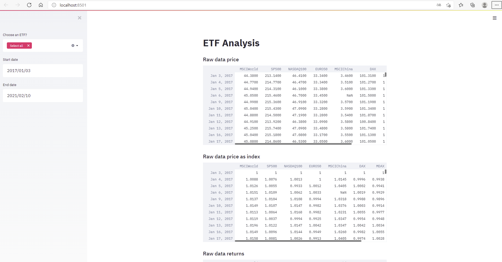

# <a name="id0"></a>Analyzing ETF with Python 

### CONTENT
### [1 - Starting point](#id1)
### [2 - Data analysis](#id2)
#### [2a - Data Preparation](#id2a)
#### [2b - Web Application](#id2b)

### -----------------------------------------------------------------------------------------------------------------------------
### <a name="id1"></a>1 - Starting point [(Back to the Top)](#id0)

Next data science area which I was interested in related to the topic of finance. When it comes to investing money many advices center around investments into ETF (i.e. exchange traded funds vs. e.g. single stocks). Therefore I wanted to get a better understanding on the variety of ETFs and their historical developments. How did the prices of different ETF develop in recent years? Which ETF had a large (annual) return over a given time period? How volatile were these returns? What is the ratio between return and volatility for a given ETF. Is there a strong positive/negative correlation amongst the returns of different ETF? 

Again, like in any data science project the first step centers around data: Where do I get appropriate data - ideally in a very automated way and always up to date? Once an interface to the relevant data source is available much work has to be conducted around the topic of analyzing this data, i.e. data preparation, applying statistical/econometric methods, presentation and visualization of results, interpretation, etc..

### <a name="id2"></a>2 - Data analysis [(Back to the Top)](#id0)

The following python scripts contain the various steps of the data preparation (step 1 & 2) and analysis (step 3) which have been conducted: 

- [Data Preparation (step 1) – Select a large ETF Universe](01_select_large_EFT_universe.py)
- [Data Preparation (step 2) - Generate data for selected ETFs](02_generate_ETF_universe_data_v1.py)
- [Analyze Data (step 3) - Construct a simple interactive platform to analyze/visualize selected ETFs](03_analyse_ETF.py)

A further and more detailed description of these python script is given below.

#### <a name="id32"></a>2a - Data Preparation [(Back to the Top)](#id0)

As always, the initial step is about getting data concerning the topic of interest, in this case ETF. When searching in the internet you find a large variety of potential libraries which offer an interface to financial data. E.g. one source is the library [pandas-datareader](https://pandas-datareader.readthedocs.io/en/latest/index.html) which offers access to various (financial) data sources. After some search in Google I decided to use the package [investpy](https://investpy.readthedocs.io/index.html) due to its documentation which I found helpful as well as the easy access to a wide range of ETFs in this library. According to its documentation the library investpy retrieves data from the finance portal [investing.com](https://www.investing.com/). After having installed investpy in the usual manner you can import the library and use the various functionalities to retrieve recent and historical data from indexed financial products. 

In a first step I would like to draw the attention to the following function [investpy.etfs.search_etfs(by, value)](https://investpy.readthedocs.io/_api/etfs.html?) which allows to search relevant ETF by components of its name. In that regards it might be good to know that the name of an ETF provides a large amount of information, such as issuing company (e.g. iShares, Xtrackers, etc.), index name (e.g. MSCI World, S&P 500, DAX, etc.) and regulatory aspects (e.g. UCITS) etc.. For a good explanation on this topic look for example [here](https://www.justetf.com/de/news/etf/wie-sie-etf-namen-einfach-entschluesseln.html). As you can see in the program my initial goal was to get an extract/universe of ETF which are issued by Blackrock and hence were named iShares. Moreover, I added some further attributes describing the ETF investment strategy (e.g. type of index, region, etc.). This information could also easily be obtained by scanning the ETF name for different words.

```
import investpy
import pandas as pd
from pandas import DataFrame

locpath1 = "C:/Users/Marc Wellner/01_projects/streamlit/02_finance_app/01_data/"

# Select iShare ETF
etf_univsel = investpy.etfs.search_etfs("name", "iShares")

pd.set_option('display.max_columns', 100)
print(etf_univsel)

# Define furhter attributes which describe the investment strategy of the ETF
etf_univsel.loc[etf_univsel['name'].str.contains('Core'),'etf_base']='Core'
etf_univsel.loc[etf_univsel['name'].str.contains('Prime'),'etf_base']='Prime'

etf_univsel.loc[etf_univsel['name'].str.contains('DAX'),'etf_index']='DAX'
etf_univsel.loc[etf_univsel['name'].str.contains('MDAX'),'etf_index']='MDAX'
etf_univsel.loc[etf_univsel['name'].str.contains('SDAX'),'etf_index']='SDAX'
etf_univsel.loc[etf_univsel['name'].str.contains('EURO STOXX'),'etf_index']='EURO STOXX'
etf_univsel.loc[etf_univsel['name'].str.contains('MSCI'),'etf_index']='MSCI'
etf_univsel.loc[etf_univsel['name'].str.contains('S&P'),'etf_index']='S&P'
etf_univsel.loc[etf_univsel['name'].str.contains('NASDAQ'),'etf_index']='NASDAQ'
etf_univsel.loc[etf_univsel['name'].str.contains('Dow Jones'),'etf_index']='Dow Jones'

etf_univsel.loc[etf_univsel['name'].str.contains('DAX'),'etf_region']='DE'
etf_univsel.loc[etf_univsel['name'].str.contains('MDAX'),'etf_region']='DE'
etf_univsel.loc[etf_univsel['name'].str.contains('SDAX'),'etf_region']='DE'
etf_univsel.loc[etf_univsel['name'].str.contains('EURO'),'etf_region']='Euro'
etf_univsel.loc[etf_univsel['name'].str.contains('Euro'),'etf_region']='Euro'
etf_univsel.loc[etf_univsel['name'].str.contains('Europe'),'etf_region']='Europe'
etf_univsel.loc[etf_univsel['name'].str.contains('Asia'),'etf_region']='Asia'
etf_univsel.loc[etf_univsel['name'].str.contains('China'),'etf_region']='China'
etf_univsel.loc[etf_univsel['name'].str.contains('USA'),'etf_region']='USA'
etf_univsel.loc[etf_univsel['name'].str.contains('World'),'etf_region']='World'

etf_univsel.loc[etf_univsel['name'].str.contains('UCITS'),'etf_ucits']='UCITS'

etf_univsel.loc[etf_univsel['name'].str.contains('MSCI World UCITS'),'etf_cat']='etf_worldbase'

# Export to xls
etf_univsel.to_excel(locpath1+"etf_univsel.xlsx", sheet_name='Tabelle1')
```

After having extracted this very broad datasheet of almost 2.000 different ETF from iShares which was then stored in an Excel file called etf_univsel.xlsx I did some further manual research obviously based on own ideas regarding an appropriate investment strategy (e.g. with regards to index, region, sectors, etc.). This process then led to a selection of 8 ETF which I wanted to analyze further and in more detail. These 8 ETF focus on equities (e.g. instead of bonds) and differentiate somehow by region, company size and sector (e.g. technology). Following ETF were selected:

```
- iShares Core MSCI World UCITS
- iShares Core S&P 500 UCITS
- iShares NASDAQ-100 UCITS
- iShares EURO STOXX 50 UCITS
- iShares MSCI China A UCITS USD
- iShares Core DAX UCITS
- iShares MDAX UCITS DE
- iShares TecDAX UCITS
```

The following script aims to extract for these 8 selected ETF a data set which contains for each ETF a time series of daily closing prices for a given time period starting 2010-01-01 and ending today. For that purpose the function [investpy.etfs.get_etf_recent_data(etf, country, stock_exchange=None, as_json=False, order='ascending', interval='Daily')](https://investpy.readthedocs.io/_api/etfs.html?) is used. The extracted data set of ETF names and abbreviations is then stored for further usage in an Excel file called etf_univ.xlsx and the data set which contains the historical daily developments of closing prices is stored in the Excel file my_etf.xls.

```
# (1) Time series of x selected ETF

# (a) Selected ETF
etf_lst = ['iShares Core MSCI World UCITS',
           'iShares Core S&P 500 UCITS',
           'iShares NASDAQ-100 UCITS',
           'iShares EURO STOXX 50 UCITS',
           'iShares MSCI China A UCITS USD',
           'iShares Core DAX UCITS',
           'iShares MDAX UCITS DE',
           'iShares TecDAX UCITS']

etf_sc_lst = ['MSCIWorld', 
              'SP500',
              'NASDAQ100',
              'EURO50',
              'MSCIChina',
              'DAX',
              'MDAX',
              'TDAX']

etf_ctry_lst = ['united kingdom',
                'united kingdom',
                'germany',
                'germany',
                'germany',
                'germany',
                'germany',
                'germany']

etf_num = ['etf1',
           'etf2',
           'etf3',
           'etf4',
           'etf5',
           'etf6',
           'etf7',
           'etf8']

etf_seli = {'etf_nm': etf_lst, 'etf_sc': etf_sc_lst, 'etf_ctry': etf_ctry_lst}
etf_univ = pd.DataFrame(etf_seli, columns = ['etf_nm','etf_sc', 'etf_ctry'], index=etf_num)
etf_univ.to_excel(locpath1+"etf_univ.xlsx", sheet_name='Tabelle1')


# (b) Selected Timeframe
ds1 = date.fromisoformat('2010-01-01').strftime("%d/%m/%Y")
ds2 = date.today().strftime("%d/%m/%Y")

rows, cols = etf_univ.shape
my_etf = pd.DataFrame({'A' : []})
for x in range(0, rows):
    print("We're on etf %d" % (x))
    print(etf_univ.iat[x,1])
    my_etf_c = investpy.etfs.get_etf_historical_data(etf = etf_univ.iat[x,0],country = etf_univ.iat[x,2], from_date=ds1, to_date=ds2, stock_exchange=None, as_json=False, order='ascending', interval='Daily')    
    my_etf_c = my_etf_c.loc[:,['Close']]            
    my_etf_c = my_etf_c.rename(columns={"Close": etf_univ.iat[x,1]})
    my_etf = pd.concat([my_etf, my_etf_c], axis = 1)

my_etf = my_etf.reset_index()
my_etf = my_etf.drop(columns=['A'])
my_etf = my_etf.rename(columns={"index": "datum"})
#my_etf
my_etf.to_excel(locpath1+"my_etf.xlsx", sheet_name='Tabelle1')
```


#### <a name="id2b"></a>2b - Web Application [(Back to the Top)](#id0)

Finally, after a data set of closing prices for the 8 ETF mention above has been created the next step is concerned with setting up a platform which allows to analyze and visualize the development of these ETF. This is the point where [streamlit](https://www.streamlit.io/) comes into play again. In a very first step the two Excel files which contain information about the 8 ETF are being loaded. 

```
import streamlit as st
#import yfinance as yf
import pandas as pd
from pandas import DataFrame
from pandas.plotting import scatter_matrix
import numpy as np
import datetime
from datetime import datetime
from datetime import date
import investpy
import matplotlib.pyplot as plt
plt.style.use('fivethirtyeight')
#from mpl_finance import candlestick_ohlc
from matplotlib.dates import DateFormatter, date2num, WeekdayLocator, DayLocator, MONDAY


locpath1 = "C:/Users/Marc Wellner/01_projects/streamlit/02_finance_app/01_data/"

#################(1) Load Data
etf_univ = pd.read_excel(locpath1+"etf_univ.xlsx", keep_default_na=False)
my_etfu = pd.read_excel(locpath1+"my_etf.xlsx", keep_default_na=False)

```

In the further part of the script the user input parameter are being defined. I.e. a select box for ETF is set up at as well as the starting and end date to define the time span which the user wants to analyze. These input parameters give users a large flexibility in terms of individually selecting his/her perspective on the analysis/visualization of ETF.

```
#################(2) Select Boxes (a) ETF (b) Time  

st.title('ETF Analysis')

####### (a) ETF
etf_univ_lst = etf_univ.loc[:,['etf_nm']]
etf_univ_lst = etf_univ_lst['etf_nm'].astype(str).values.tolist()

lst = []
lst = etf_univ_lst
lst.append('Select all')

ulst = st.sidebar.multiselect('Choose an ETF?',lst)

if 'Select all' in ulst :
	ulst = etf_univ_lst

#st.write(ulst)


####### (b) ETF
d1 = date.fromisoformat('2010-01-01')
d2 = date.today()
#d2 = date.today()
#print(today)
#print(startdate)

du1 = st.sidebar.date_input('Start date', d1)
du2 = st.sidebar.date_input('End date', d2)

#if du1 < du2:
#    st.success('Start date: `%s`\n\nEnd date: `%s`' % (du1, du2))
#else:
#    st.error('Error: End date must fall after start date.')

#delta = du2 - du1

dus1 = du1.strftime("%d/%m/%Y")
dus2 = du2.strftime("%d/%m/%Y")

##w/o user input 
#delta = d2 - d1
#ds1 = d1.strftime("%d/%m/%Y")
#ds2 = d2.strftime("%d/%m/%Y")

#st.write(dus1)
#st.write(dus2)

```

With user input parameters at hand the next part of the script is concerned with loading this specific user selected data and displaying the raw price data of the selected ETF. This can be done in a straight forward manner by using the streamlit function st.write. Moreover, an index for each ETF is being calculate where starting point of the time span refers to 1. This index shall help to compare price developments amongst the different ETF. Finally, the daily returns are being calculated and displayed for each selected ETF.

```
#################(3) Load User selected Data

etf_univ_sel = etf_univ[etf_univ['etf_nm'].isin(ulst)]
etf_univ_sel = etf_univ[etf_univ['etf_nm'].isin(ulst)]
etf_univ_selsc = etf_univ_sel.loc[:,['etf_sc']]
etf_univ_selsclst = etf_univ_selsc['etf_sc'].astype(str).values.tolist()
etf_univ_selsclst.append("datum")
my_etf = my_etfu[my_etfu.columns.intersection(etf_univ_selsclst)]
#my_etf["dates"] = my_etf.datum
my_etf.loc[:,"dates"] = pd.to_datetime(my_etf.loc[:,'datum']).dt.date
my_etf = my_etf[(my_etf.dates >= du1) & (my_etf.dates <= du2)] 

my_etf.index = pd.DatetimeIndex(my_etf["datum"])
my_etf = my_etf.drop(columns=["datum", "dates"])
#my_etf
for c in my_etf.columns.values:
    my_etf[c] = pd.to_numeric(my_etf[c],errors='coerce')
#my_etf.dtypes

rows, cols = my_etf.shape
etf_amt = cols

st.subheader('Raw data price')
st.write(my_etf)

st.subheader('Raw data price as index')
my_etf_i = my_etf/my_etf.iloc[0]
st.write(my_etf_i)

st.subheader('Raw data returns')
my_etf_r = my_etf.pct_change()
st.write(my_etf_r)

```

The next part of the script is concerned with plotting the data mentioned above. Here the streamlit function st.pyplot is being used

```
#################(4) Plot Time series 
#### (a)price
st.subheader('Time series plots')

title = 'ETF Close Price History'
fig, ax = plt.subplots()
for c in my_etf.columns.values:
    my_etf[c].plot(label = c, figsize=(14,5) )

plt.title(title)
plt.xlabel('Date')
plt.ylabel('Price EUR (€)')
plt.legend(my_etf.columns.values, loc='upper left')
#    plt.show()

st.pyplot(fig)


#### (b) price as index number 
#my_etf_i = my_etf/my_etf.iloc[0]

fig, ax = plt.subplots()
title = 'ETF Close Index History'
for c in my_etf_i.columns.values:
    my_etf_i[c].plot(label = c, figsize=(14,5) )
plt.title(title)
plt.xlabel('Date')
plt.ylabel('Index')
plt.legend(my_etf_i.columns.values, loc='upper left')
plt.show()

st.pyplot(fig)

#### (c) returns
#my_etf_r = my_etf.pct_change()

fig, ax = plt.subplots()
title = 'ETF Returns History'
for c in my_etf_r.columns.values:
    my_etf_r[c].plot(label = c, figsize=(14,5) )
plt.title(title)
plt.xlabel('Date')
plt.ylabel('Returns (in pct)')
plt.legend(my_etf_i.columns.values, loc='upper left')
plt.show()

st.pyplot(fig)
```

The next section of the script aims to calculate the annual returns and volatility for each ETF over the selected time span. Moreover the return and volatility of an equally weighted portfolio of the selected ETF is being calculated too. These figures are then loaded into a data frame which is displayed to the user by means of the streamlit function st.write.

```
###############(5) Caluclation of Annual Returns and Volatility 

#### Returns
returns_annual = my_etf_r.mean()*252
#returns_annual

#### Variance
var_annual = my_etf_r.var()*252
#var_annual

#### Volatility
std_annual = np.sqrt(var_annual)
#std_annual

#### KPI
my_etf_kpi = pd.concat([returns_annual,std_annual], axis = 1)
my_etf_kpi.columns = ['Return', 'Volatility']
#my_etf_kpi

#st.subheader('Annual returns vs. volatility')
#st.write(my_etf_kpi)


#################(6) Caluclation of equal weighted Portfolio 

###List of weights
weights = [1/etf_amt] * etf_amt
#print(weights)
#weights

####Return
port_return = np.sum(my_etf_r.mean()*weights)*252
#port_return

#### Portfolio Variance/Volatility
# Annual Covariance of returns
cov_matrix_annual = my_etf_r.cov()*252
##cov_matrix_annual

port_variance = np.dot(weights, np.dot(cov_matrix_annual, weights))
#port_variance
port_volatility = np.sqrt(port_variance)
#port_volatility


##### KPI
pf_data = {'Return': [port_return], 'Volatility': [port_volatility]}
my_etfpf_kpi = pd.DataFrame(pf_data, columns = ['Return','Volatility'], index=['PFEqualw'])
#my_etfpf_kpi
my_etf_kpi = my_etf_kpi.append(my_etfpf_kpi)

st.subheader('Annual returns vs. volatility for ETFs vs equally weighted Portfolio')
st.write(my_etf_kpi)
```

Finally, in the last part of the script library [PyPortfolioOpt]( https://pyportfolioopt.readthedocs.io/en/latest/) is being used in order to look at the selected ETF from a portfolio optimisation perspective (i.e. in terms of risk-efficiency) using e.g. classical efficient frontier techniques and Black-Litterman allocation. Obviously in a very first step the library has to be install in the usual manner and then the respective functions need to be included in the script. As output the user will get information on the return and volatility of the optimal portfolio as well as the weighting of the ETF which are included into the portfolio optimization. Finally, for a hypothetical investment of $100.000 the optimal allocation of ETF amounts is being displayed.

```
#### (7) Optimal Portfolio (according to "Efficient Frontier")


from pypfopt.efficient_frontier import EfficientFrontier
from pypfopt import risk_models
from pypfopt import expected_returns

#my_etf

# Calculation of expected returns and annualized sample covariance matrix of asset returns
mu = expected_returns.mean_historical_return(my_etf)
S  = risk_models.sample_cov(my_etf)

# Optimize for max sharpe ratio (expected returns/volatility)
ef = EfficientFrontier(mu,S)
wght = ef.max_sharpe()
#print(wght)
clean_wght = ef.clean_weights()
#print(clean_wght)

index = ['Expected annual return:', 'Annual volatility:', 'Sharpe Ratio:']
columns = ['KPI opt PF']
kpi_opt_pf = pd.DataFrame(ef.portfolio_performance(verbose = True),columns=columns,  index=index)


from collections import OrderedDict, Counter

ord_list = [OrderedDict(clean_wght)]
#ord_list
col = Counter()
for k in ord_list:
    col.update(k)
wght_opt_pf = pd.DataFrame([k.values() for k in ord_list], columns = col.keys())


#Get the dicrete allocation for each share per stock

from pypfopt.discrete_allocation import DiscreteAllocation, get_latest_prices

latest_prices = get_latest_prices(my_etf)
wght = clean_wght
da = DiscreteAllocation(wght, latest_prices, total_portfolio_value = 100000)
allocation, leftover = da.lp_portfolio()

alloc_opt_pf = pd.DataFrame.from_dict(allocation,orient = 'index', columns=['Amount'])


st.subheader('Optimal Portfolio according to Efficient Frontier would lead to ... ')

st.subheader('... following results:')
kpi_opt_pf

st.subheader('... following weights:')
wght_opt_pf

st.subheader('... for an investment of $100.000 following allocation of ETF amounts would be optimal:')
alloc_opt_pf
```

Of course, there are many more potential directions for a further statistic and econometric analysis, such as analyzing ETF returns and their volatility by means time series models (e.g. ARMA, GARCH, etc.) but this will be done in another project :-).

Below you find some screen shots for the streamlit app described above. 



Similar to the project "covid scan app" I have transferred to whole process in an automated manner to a cloud environment. The respective link is found here: [Application: ETF Analysis](http://18.192.208.203:8502/)


